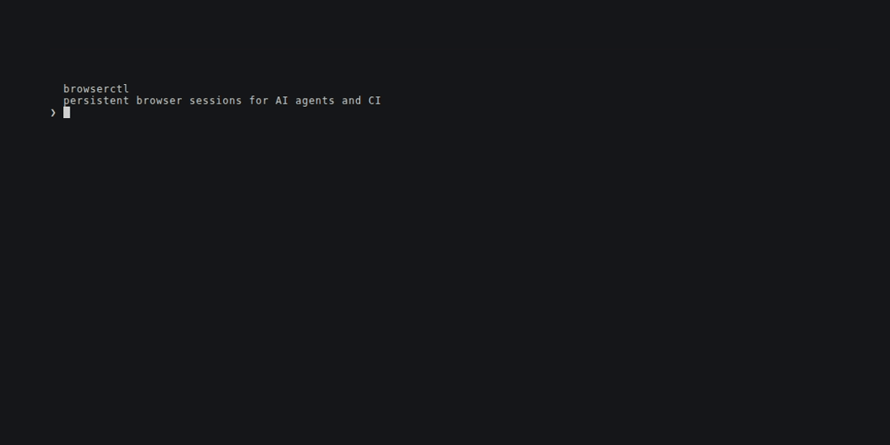
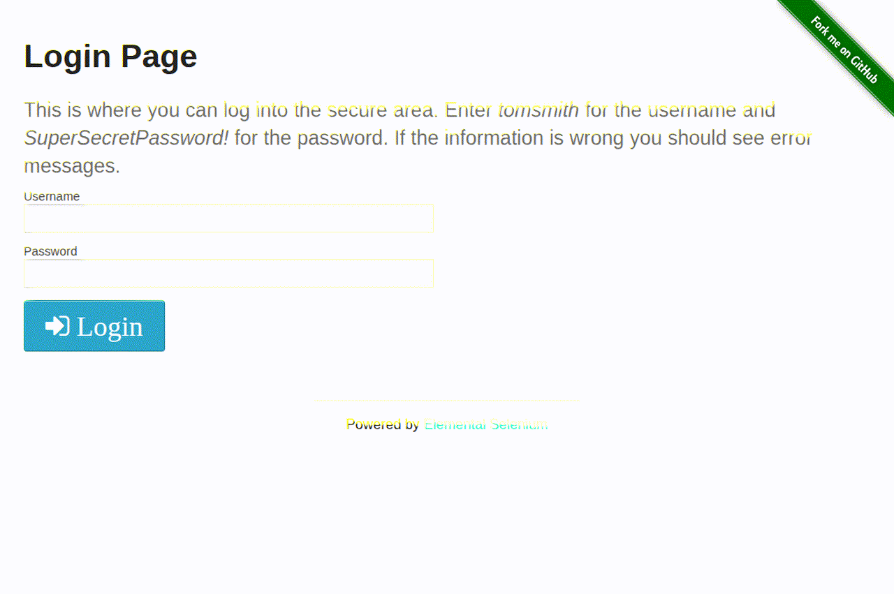

<p align="center">
  
</p>

<h1 align="center">browserctl</h1>

<p align="center">
  A browser daemon that keeps sessions alive between commands — for AI agents and iterative dev workflows.
</p>

<p align="center">
  <a href="https://github.com/patrick204nqh/browserctl/actions/workflows/ci.yml"></a>
  <a href="https://badge.fury.io/rb/browserctl"></a>
  <a href="https://rubygems.org/gems/browserctl"></a>
</p>

---

Every browser automation tool restarts the browser when your script ends. That means re-authenticating, re-navigating, re-loading state — on every run. browserctl doesn't restart. The session stays alive between commands, so you pick up exactly where you left off.

```bash
browserd &                                               # start the daemon (headless)
browserctl page open main --url https://example.com/login
browserctl snapshot main                                 # AI-friendly JSON snapshot with ref IDs
browserctl fill main --ref e1 --value me@example.com    # interact by ref, no selectors needed
browserctl click main --ref e2
browserctl daemon stop
```

---

## See it in action

<table align="center"><tr>
<td align="center" width="50%">

**Terminal**<br/>
<sub>CLI commands, live output, session persistence proof</sub>



</td>
<td align="center" width="50%">

**Browser**<br/>
<sub>What the browser sees as those commands run</sub>



</td>
</tr></table>

---

## Quick Start

```bash
# 1. Install
gem install browserctl

# 2. Start the daemon
browserd &

# 3. Open a named page
browserctl page open main --url https://moatazeldebsy.github.io/test-automation-practices/#/auth

# 4. Snapshot — returns JSON with a ref ID per interactable element
browserctl snapshot main
# → [{"ref":"e1","tag":"input","attrs":{"data-test":"username-input"}}, {"ref":"e2",...}, {"ref":"e3","tag":"button","text":"Login",...}]

# 5. Interact using the ref IDs from the snapshot
browserctl fill main --ref e1 --value admin
browserctl fill main --ref e2 --value admin
browserctl click main --ref e3

# 6. Observe
browserctl url main
browserctl snapshot main --diff   # only what changed

# 7. Done
browserctl daemon stop
```

→ [Full Getting Started guide](docs/getting-started.md)

---

## Use cases

**AI coding agent authenticating into a staging environment** — the agent logs in once, the session persists, subsequent commands run inside the authenticated context without re-authenticating between steps.

**Developer reproducing a multi-step bug report** — navigate to the failure point once, then iterate on the fix with the browser already in the right state; no restarting from the home page each run.

**Automated smoke test that needs human sign-off** — the test runs until it hits something ambiguous, calls `browserctl pause`, lets a human inspect and act, then `browserctl resume` hands control back to the script with all state intact.

---

## Why browserctl?

Most automation tools are stateless — every script spins up a fresh browser and tears it down. browserctl doesn't.

| Capability | browserctl | Playwright / Selenium |
|---|---|---|
| Session persists across commands | ✓ | ✗ (per-script lifecycle) |
| Named page handles | ✓ | ✗ |
| AI-friendly DOM snapshot | ✓ | ✗ |
| Human-in-the-loop pause/resume | ✓ | ✗ |
| Lightweight CLI interface | ✓ | ✗ |
| Full browser automation API | — | ✓ |
| Parallel multi-browser testing | — | ✓ |

**Use browserctl when** you need a browser that stays alive and remembers state — for AI agents, iterative dev workflows, or tasks that mix automation with human judgment.

**Use Playwright/Selenium when** you need parallel test suites, multi-browser support, or a full programmatic API.

---

## Installation

**Requirements:** Ruby >= 3.3 · Chrome or Chromium installed

```bash
gem install browserctl
```

Or in your `Gemfile`:

```ruby
gem "browserctl"
```

---

## Claude Code Plugin

browserctl ships as a Claude Code plugin. Install it once and Claude automatically knows how to use the daemon, ref-based interaction, HITL patterns, and workflow authoring.

**Interactive install**

```
/plugin marketplace add patrick204nqh/browserctl
/plugin install browserctl@browserctl
```

**Project settings** — commit `.claude/settings.json` to share with your team:

```json
{
  "extraKnownMarketplaces": {
    "browserctl": {
      "source": { "source": "github", "repo": "patrick204nqh/browserctl" }
    }
  },
  "enabledPlugins": {
    "browserctl@browserctl": true
  }
}
```

Once installed, the `browserctl` skill loads automatically.

---

## How it works

`browserd` runs as a background process, listening on a Unix socket at `~/.browserctl/browserd.sock`. It manages a Ferrum (Chrome DevTools Protocol) browser instance with named page handles. `browserctl` sends JSON-RPC commands over the socket and prints the result.

Start multiple named instances for agent isolation:

```bash
browserd --name agent-a &
browserd --name agent-b &
browserctl --daemon agent-a page open main --url https://app.example.com
```

The daemon shuts itself down after 30 minutes of inactivity.

---

## Documentation

| | |
|---|---|
| [Getting Started](docs/getting-started.md) | Install, first session, first snapshot |
| [Concepts](docs/concepts/) | Sessions, snapshots, human-in-the-loop |
| [Guides](docs/guides/) | Writing workflows, handling challenges, smoke testing |
| [Command Reference](docs/reference/commands.md) | Every command and flag |
| [API Stability](docs/reference/api-stability.md) | Wire protocol contract and stability zones |
| [Product](docs/product.md) | What browserctl is and who it's for |
| [Vision & Roadmap](docs/vision.md) | Philosophy and release roadmap |
| [vs. agent-browser](docs/vs-agent-browser.md) | How browserctl differs from Vercel's agent-browser |

---

## Development

```bash
git clone https://github.com/patrick204nqh/browserctl
cd browserctl
bin/setup              # brew bundle (macOS) + bundle install + Chrome check

bundle exec rspec      # run tests
bundle exec rubocop    # lint

rake demo               # full pipeline: screenshots + browser GIF + terminal GIF
rake demo:screenshots   # smoke test screenshots only
rake demo:browser_gif   # browser animation only  (requires: ffmpeg)
rake demo:terminal      # terminal GIF only        (requires: vhs)
```

> Demo assets are regenerated automatically on every push to `main` that touches `demo/` or the login example.

---

## Contributing

See [CONTRIBUTING.md](CONTRIBUTING.md) · [SECURITY.md](SECURITY.md)

## License

[MIT](LICENSE)
