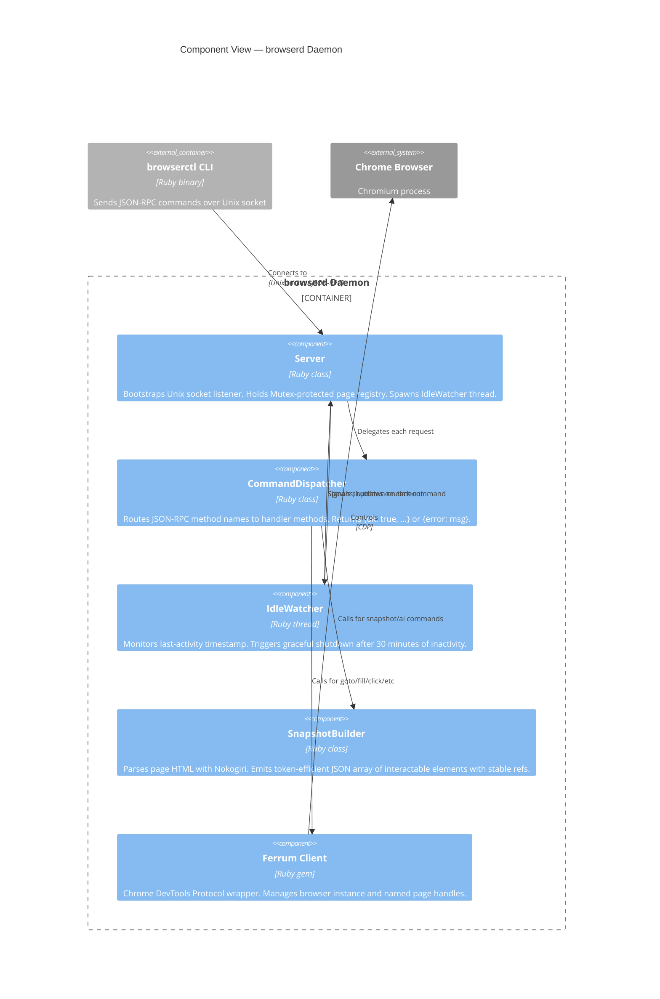

# C4 Level 3 — Component View

Internal components of the `browserd` daemon.

```mermaid
C4Component
  title Component View — browserd Daemon

  Container_Ext(cli, "browserctl CLI", "Ruby binary", "Sends JSON-RPC commands over Unix socket")

  Container_Boundary(daemon, "browserd Daemon") {
    Component(server, "Server", "Ruby class", "Bootstraps Unix socket listener. Holds Mutex-protected page registry. Spawns IdleWatcher thread.")
    Component(dispatcher, "CommandDispatcher", "Ruby class", "Routes JSON-RPC method names to handler methods. Returns {ok: true, ...} or {error: msg}.")
    Component(idle, "IdleWatcher", "Ruby thread", "Monitors last-activity timestamp. Triggers graceful shutdown after 30 minutes of inactivity.")
    Component(snapshot, "SnapshotBuilder", "Ruby class", "Parses page HTML with Nokogiri. Emits token-efficient JSON array of interactable elements with stable refs.")
    Component(ferrum, "Ferrum Client", "Ruby gem", "Chrome DevTools Protocol wrapper. Manages browser instance and named page handles.")
  }

  System_Ext(chrome, "Chrome Browser", "Chromium process")

  Rel(cli, server, "Connects to", "Unix socket / JSON-RPC")
  Rel(server, dispatcher, "Delegates each request")
  Rel(dispatcher, snapshot, "Calls for snapshot/ai commands")
  Rel(dispatcher, ferrum, "Calls for goto/fill/click/etc")
  Rel(server, idle, "Spawns; updates on each command")
  Rel(idle, server, "Signals shutdown on timeout")
  Rel(ferrum, chrome, "Controls", "CDP")
```
