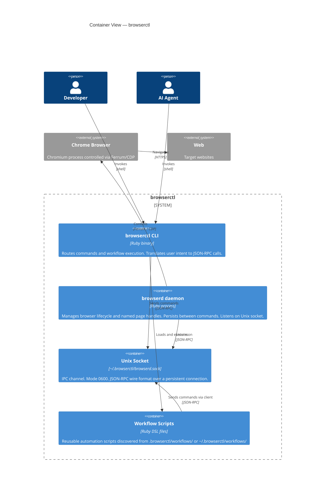

# C4 Level 2 — Container View

Runtime processes and how they communicate.

```mermaid
C4Container
  title Container View — browserctl

  Person(dev, "Developer")
  Person(agent, "AI Agent")

  System_Boundary(browserctl_system, "browserctl") {
    Container(cli, "browserctl CLI", "Ruby binary", "Routes commands and workflow execution. Translates user intent to JSON-RPC calls.")
    Container(daemon, "browserd daemon", "Ruby process", "Manages browser lifecycle and named page handles. Persists between commands. Listens on Unix socket.")
    Container(socket, "Unix Socket", "~/.browserctl/browserd.sock", "IPC channel. Mode 0600. JSON-RPC wire format over a persistent connection.")
    Container(workflows, "Workflow Scripts", "Ruby DSL files", "Reusable automation scripts discovered from .browserctl/workflows/ or ~/.browserctl/workflows/")
  }

  System_Ext(chrome, "Chrome Browser", "Chromium process controlled via Ferrum/CDP")
  System_Ext(web, "Web", "Target websites")

  Rel(dev, cli, "Invokes", "shell")
  Rel(agent, cli, "Invokes", "shell")
  Rel(cli, socket, "Sends commands", "JSON-RPC")
  Rel(daemon, socket, "Listens on", "JSON-RPC")
  Rel(cli, workflows, "Loads and executes")
  Rel(workflows, socket, "Sends commands via client", "JSON-RPC")
  Rel(daemon, chrome, "Controls", "Ferrum / CDP")
  Rel(chrome, web, "Navigates", "HTTPS")
```
