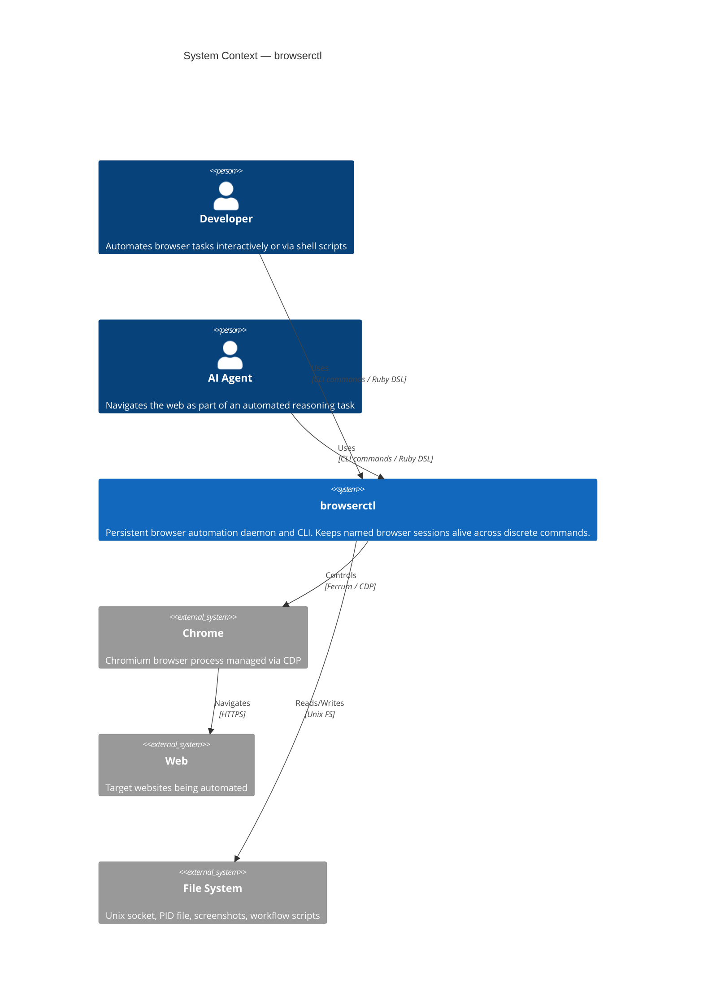

# C4 Level 1 — System Context

Who uses browserctl and what external systems does it touch.

```mermaid
C4Context
  title System Context — browserctl

  Person(dev, "Developer", "Automates browser tasks interactively or via shell scripts")
  Person(agent, "AI Agent", "Navigates the web as part of an automated reasoning task")

  System(browserctl, "browserctl", "Persistent browser automation daemon and CLI. Keeps named browser sessions alive across discrete commands.")

  System_Ext(chrome, "Chrome", "Chromium browser process managed via CDP")
  System_Ext(web, "Web", "Target websites being automated")
  System_Ext(fs, "File System", "Unix socket, PID file, screenshots, workflow scripts")

  Rel(dev, browserctl, "Uses", "CLI commands / Ruby DSL")
  Rel(agent, browserctl, "Uses", "CLI commands / Ruby DSL")
  Rel(browserctl, chrome, "Controls", "Ferrum / CDP")
  Rel(chrome, web, "Navigates", "HTTPS")
  Rel(browserctl, fs, "Reads/Writes", "Unix FS")
```
