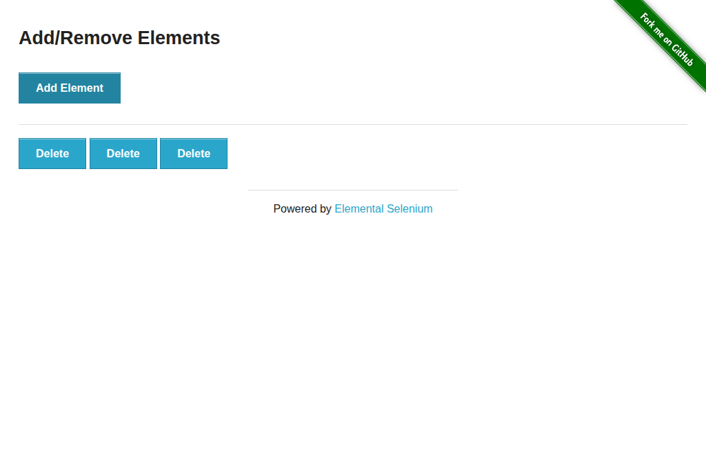

# Smoke Testing with Practice Sites

browserctl ships with ready-to-run examples against two publicly available test sites purpose-built for browser automation practice.

- **[the-internet.herokuapp.com](https://the-internet.herokuapp.com)** — a wide-ranging sandbox covering common UI patterns (login, checkboxes, dropdowns, dynamic loading, DOM mutation)
- **[practicetestautomation.com](https://practicetestautomation.com)** — a focused site with a clean login sandbox and dedicated exception-reproduction scenarios

## Running the examples

```bash
# Start the daemon with a visible browser window
browserd --headed &

# the-internet examples
browserctl run examples/the_internet/login.rb
browserctl run examples/the_internet/checkboxes.rb
browserctl run examples/the_internet/dropdown.rb
browserctl run examples/the_internet/dynamic_loading.rb
browserctl run examples/the_internet/add_remove_elements.rb

# practicetestautomation.com examples
browserctl run examples/practice_test_automation/login.rb
browserctl run examples/practice_test_automation/login_negative.rb
browserctl run examples/practice_test_automation/exceptions.rb

browserctl shutdown
```

Expected output for each (example shown for login):

```
  [ok]   open login page
  [ok]   fill and submit credentials
  [ok]   verify secure area
  [ok]   logout and verify
  [ok]   capture screenshot
```

Each example saves a screenshot to `docs/assets/` on completion. Screenshots are regenerated automatically by the [Update Demo Assets](../../.github/workflows/assets.yml) workflow when examples change, and can also be triggered manually from the Actions tab.

---

## Examples

### `the_internet/login.rb` — Form Authentication

Covers: `fill`, `click`, `url`, `evaluate`

Navigates to the login page, fills in the public test credentials, submits the form, asserts the redirect to `/secure` and the success flash message, then logs out and verifies the logout flash.

**Test credentials:** `tomsmith` / `SuperSecretPassword!`

```
  [ok]   open login page
  [ok]   fill and submit credentials
  [ok]   verify secure area
  [ok]   logout and verify
  [ok]   capture screenshot
```


---

### `the_internet/checkboxes.rb` — Checkboxes

Covers: `evaluate`, `click`

Reads the initial checkbox states (`[false, true]`), toggles the first checkbox, and asserts both are now checked.

```
  [ok]   open checkboxes page
  [ok]   read initial state
  [ok]   toggle first checkbox on
  [ok]   verify both checkboxes are now checked
  [ok]   capture screenshot
```


---

### `the_internet/dropdown.rb` — Dropdown Select

Covers: `evaluate`

Asserts the default dropdown has no selection, then selects Option 1 and Option 2 in sequence via JavaScript, verifying the selected text after each change.

> **Note:** browserctl has no native `select` command. Use `evaluate` to set `select.value` directly — this is the recommended pattern for dropdown interaction.

```
  [ok]   open dropdown page
  [ok]   assert default is unselected
  [ok]   select Option 1
  [ok]   select Option 2
  [ok]   capture screenshot
```


---

### `the_internet/dynamic_loading.rb` — Dynamic Loading

Covers: `click`, `wait_for`, `evaluate`

Verifies the finish element is hidden before clicking Start, then clicks the Start button and waits up to 10 seconds for `#finish h4` to appear, asserting its text is `"Hello World!"`.

This example demonstrates the `wait_for` command — useful any time a page renders content asynchronously.

```
  [ok]   open dynamic loading page
  [ok]   assert finish text is hidden before start
  [ok]   click Start and wait for content
  [ok]   assert finish text is correct
  [ok]   capture screenshot
```


---

### `the_internet/add_remove_elements.rb` — Add/Remove Elements

Covers: `click`, `evaluate`

Clicks "Add Element" three times, asserts three delete buttons are present, removes them one by one, and asserts the list is empty at the end.

```
  [ok]   open add/remove elements page
  [ok]   add three elements
  [ok]   remove one element
  [ok]   remove all remaining elements
  [ok]   capture screenshot
```



---

---

## practicetestautomation.com examples

### `practice_test_automation/login.rb` — Login and Logout

Covers: `fill`, `click`, `url`, `evaluate`

Navigates to the login sandbox, fills in the public test credentials, submits the form, asserts the redirect to the success page and the heading text, then clicks the logout link and verifies the return to the login page.

**Test credentials:** `student` / `Password123`

```
  [ok]   open login page
  [ok]   fill and submit credentials
  [ok]   verify successful login
  [ok]   logout and verify
```

---

### `practice_test_automation/login_negative.rb` — Invalid Credentials

Covers: `fill`, `click`, `evaluate`

Submits an invalid username (keeping the correct password) and asserts the "Your username is invalid!" error message, then submits an invalid password (keeping the correct username) and asserts the "Your password is invalid!" error message.

Demonstrates negative-path testing: verifying that error states are correctly surfaced rather than silently failing.

```
  [ok]   open login page
  [ok]   submit invalid username — expect username error
  [ok]   submit invalid password — expect password error
```

---

### `practice_test_automation/exceptions.rb` — Dynamic Elements and Disabled Fields

Covers: `click`, `fill`, `evaluate`, `watch`

Demonstrates three patterns that trip up naive automation scripts:

1. **Disabled input (InvalidElementStateException avoidance)** — clicks the Edit button to enable a read-only field before filling it.
2. **Dynamically added element (NoSuchElementException avoidance)** — clicks Add and uses `watch` to poll until row 2 appears after its 5-second server-side delay.
3. **Confirmation message** — asserts the transient "Row 2 was added" text before it fades.

```
  [ok]   open test exceptions page
  [ok]   enable row 1 input and edit it (InvalidElementStateException avoidance)
  [ok]   click Add and wait for row 2 to appear (NoSuchElementException avoidance)
  [ok]   verify confirmation message
  [ok]   type into row 2 input and save
  [ok]   remove row 2
```

---

## Patterns demonstrated

| Pattern | Where it appears |
|---------|-----------------|
| Open a named page with initial URL | All examples — `client.open_page("main", url: ...)` |
| Fill form inputs | `login.rb` — `page(:main).fill(selector, value)` |
| Click buttons and links | All examples — `page(:main).click(selector)` |
| Assert current URL | `login.rb` — `page(:main).url` |
| Read DOM state via JS | `checkboxes.rb`, `dropdown.rb`, `add_remove_elements.rb` — `client.evaluate("main", expression)[:result]` |
| Set DOM state via JS | `dropdown.rb` — `client.evaluate("main", "document.querySelector('select#dropdown').value = '1'")` |
| Wait for async element (short) | `dynamic_loading.rb` — `page(:main).wait_for(selector, timeout:)` |
| Poll for async element (long) | `exceptions.rb` — `page(:main).watch(selector, timeout:)` |
| Negative-path assertion | `login_negative.rb` — assert error message text on failed login |
| Assert with message | All examples — `assert condition, "message"` |
