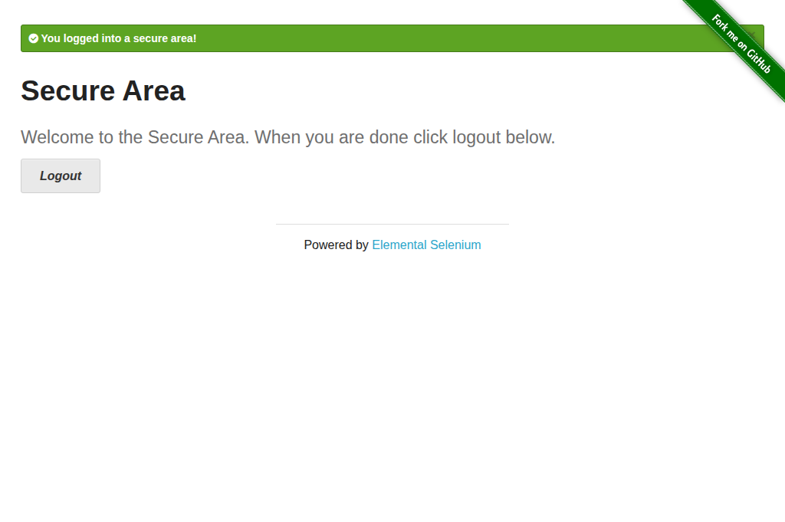
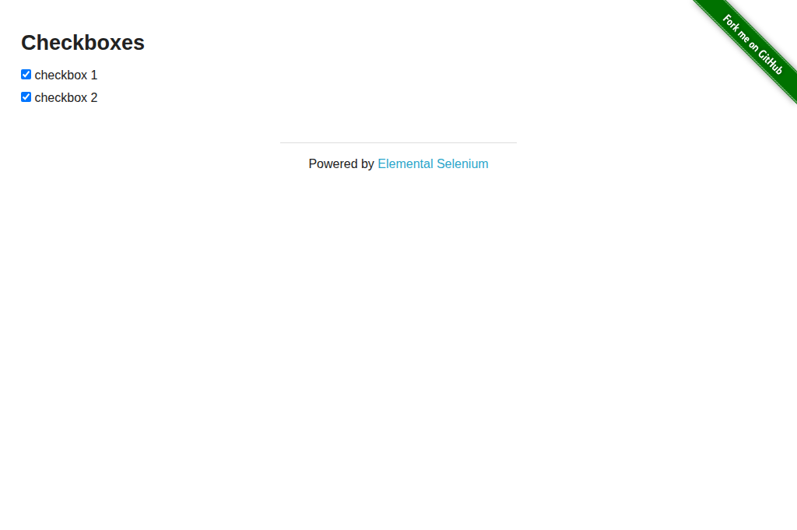
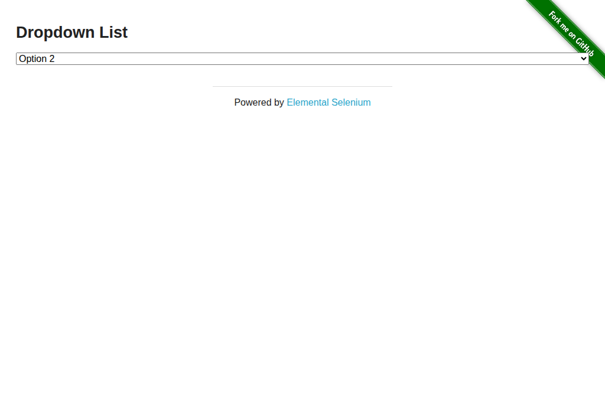
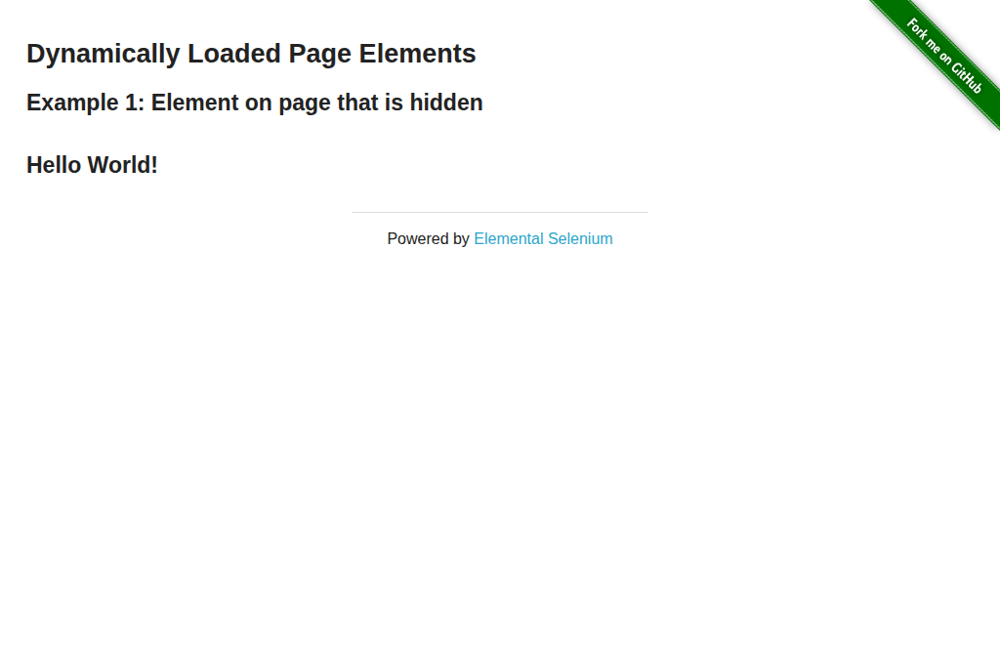

# Smoke Testing with the-internet.herokuapp.com

[the-internet.herokuapp.com](https://the-internet.herokuapp.com) is a publicly available test site purpose-built for browser automation practice. browserctl ships with ready-to-run examples covering its most common scenarios.

## Running the examples

```bash
# Start the daemon with a visible browser window
browserd --headed &

# Run any example directly by file path
browserctl run examples/the_internet/login.rb
browserctl run examples/the_internet/checkboxes.rb
browserctl run examples/the_internet/dropdown.rb
browserctl run examples/the_internet/dynamic_loading.rb
browserctl run examples/the_internet/add_remove_elements.rb

browserctl shutdown
```

Expected output for each (example shown for login):

```
  [ok]   open login page
  [ok]   fill and submit credentials
  [ok]   verify secure area
  [ok]   logout and verify
  [ok]   capture screenshot
```

Each example saves a screenshot to `docs/screenshots/` on completion. Screenshots are regenerated automatically by the [Update Screenshots](../../.github/workflows/screenshots.yml) workflow when examples change, and can also be triggered manually from the Actions tab.

---

## Examples

### `the_internet/login.rb` — Form Authentication

Covers: `fill`, `click`, `url`, `evaluate`

Navigates to the login page, fills in the public test credentials, submits the form, asserts the redirect to `/secure` and the success flash message, then logs out and verifies the logout flash.

**Test credentials:** `tomsmith` / `SuperSecretPassword!`

```
  [ok]   open login page
  [ok]   fill and submit credentials
  [ok]   verify secure area
  [ok]   logout and verify
  [ok]   capture screenshot
```



---

### `the_internet/checkboxes.rb` — Checkboxes

Covers: `evaluate`, `click`

Reads the initial checkbox states (`[false, true]`), toggles the first checkbox, and asserts both are now checked.

```
  [ok]   open checkboxes page
  [ok]   read initial state
  [ok]   toggle first checkbox on
  [ok]   verify both checkboxes are now checked
  [ok]   capture screenshot
```



---

### `the_internet/dropdown.rb` — Dropdown Select

Covers: `evaluate`

Asserts the default dropdown has no selection, then selects Option 1 and Option 2 in sequence via JavaScript, verifying the selected text after each change.

> **Note:** browserctl has no native `select` command. Use `evaluate` to set `select.value` directly — this is the recommended pattern for dropdown interaction.

```
  [ok]   open dropdown page
  [ok]   assert default is unselected
  [ok]   select Option 1
  [ok]   select Option 2
  [ok]   capture screenshot
```



---

### `the_internet/dynamic_loading.rb` — Dynamic Loading

Covers: `click`, `wait_for`, `evaluate`

Verifies the finish element is hidden before clicking Start, then clicks the Start button and waits up to 10 seconds for `#finish h4` to appear, asserting its text is `"Hello World!"`.

This example demonstrates the `wait_for` command — useful any time a page renders content asynchronously.

```
  [ok]   open dynamic loading page
  [ok]   assert finish text is hidden before start
  [ok]   click Start and wait for content
  [ok]   assert finish text is correct
  [ok]   capture screenshot
```



---

### `the_internet/add_remove_elements.rb` — Add/Remove Elements

Covers: `click`, `evaluate`

Clicks "Add Element" three times, asserts three delete buttons are present, removes them one by one, and asserts the list is empty at the end.

```
  [ok]   open add/remove elements page
  [ok]   add three elements
  [ok]   remove one element
  [ok]   remove all remaining elements
  [ok]   capture screenshot
```


---

## Patterns demonstrated

| Pattern | Where it appears |
|---------|-----------------|
| Open a named page with initial URL | All examples — `client.open_page("main", url: ...)` |
| Fill form inputs | `login.rb` — `page(:main).fill(selector, value)` |
| Click buttons and links | All examples — `page(:main).click(selector)` |
| Assert current URL | `login.rb` — `page(:main).url` |
| Read DOM state via JS | `checkboxes.rb`, `dropdown.rb`, `add_remove_elements.rb` — `client.evaluate("main", expression)[:result]` |
| Set DOM state via JS | `dropdown.rb` — `client.evaluate("main", "document.querySelector('select#dropdown').value = '1'")` |
| Wait for async element | `dynamic_loading.rb` — `page(:main).wait_for(selector, timeout:)` |
| Assert with message | All examples — `assert condition, "message"` |
