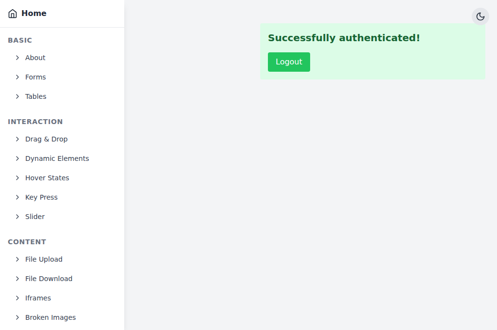
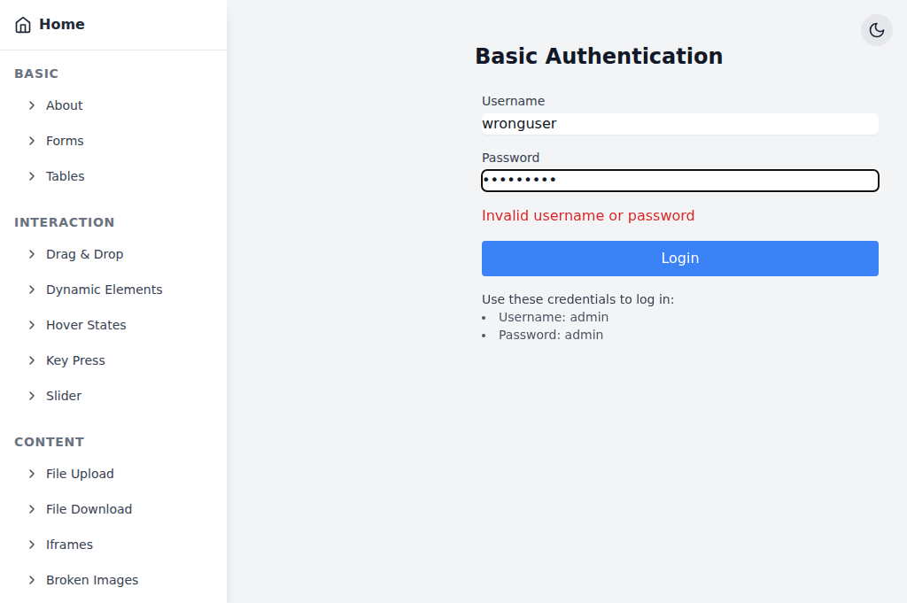
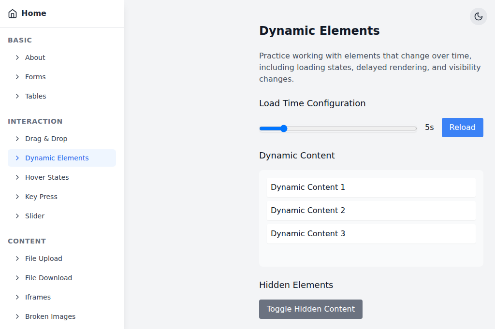
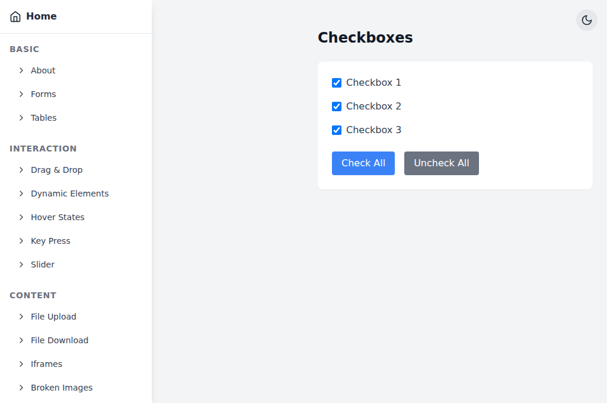
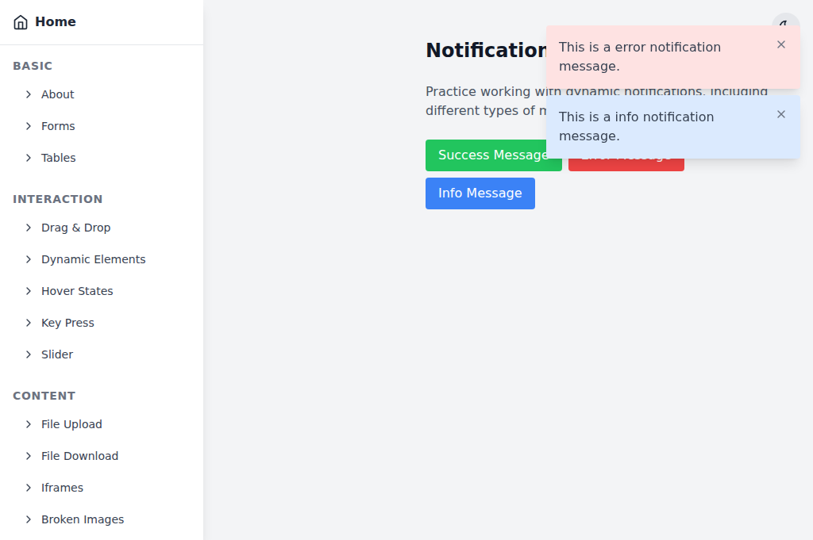
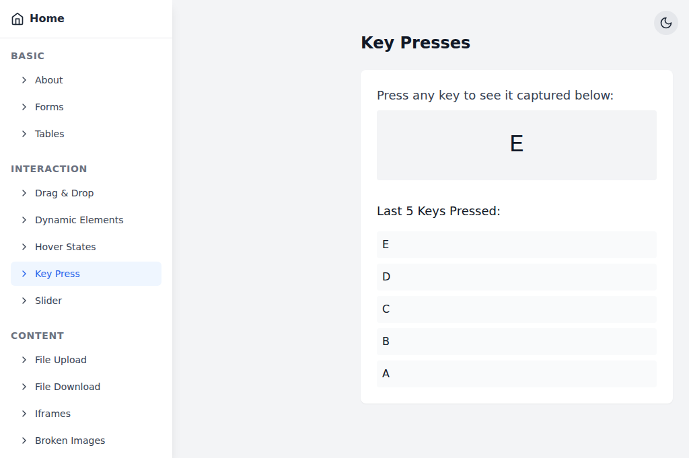

# Smoke Testing with Practice Sites

browserctl ships with ready-to-run examples against two publicly available test sites purpose-built for browser automation practice.

- **[the-internet.herokuapp.com](https://the-internet.herokuapp.com)** — a wide-ranging sandbox covering common UI patterns (login, checkboxes, dropdowns, dynamic loading, DOM mutation)
- **[test-automation-practices](https://moatazeldebsy.github.io/test-automation-practices)** — a self-contained React SPA with 20+ purpose-built test scenarios: auth flows, dynamic content, notifications, checkboxes, keyboard input, and more

## Running the examples

```bash
# Start the daemon with a visible browser window
browserd --headed &

# the-internet examples
browserctl run examples/the_internet/login.rb
browserctl run examples/the_internet/checkboxes.rb
browserctl run examples/the_internet/dropdown.rb
browserctl run examples/the_internet/dynamic_loading.rb
browserctl run examples/the_internet/add_remove_elements.rb

# test-automation-practices examples
browserctl run examples/test_automation_practices/login.rb
browserctl run examples/test_automation_practices/login_negative.rb
browserctl run examples/test_automation_practices/dynamic_elements.rb
browserctl run examples/test_automation_practices/checkboxes.rb
browserctl run examples/test_automation_practices/notifications.rb
browserctl run examples/test_automation_practices/key_press.rb

browserctl shutdown
```

Expected output for the login example:

```
  [ok]   open login page
  [ok]   fill and submit credentials
  [ok]   verify successful login
  [ok]   logout and verify
```

Each example saves a screenshot to `docs/assets/` on completion. Screenshots are regenerated automatically by the [Update Demo Assets](../../.github/workflows/assets.yml) workflow when examples change, and can also be triggered manually from the Actions tab.

---

## test-automation-practices examples

Target: `https://moatazeldebsy.github.io/test-automation-practices` — a self-hosted React SPA that can also be run locally with `npm run dev`. All interactive elements carry `data-test` attributes for stable targeting.

### `test_automation_practices/login.rb` — Login and Logout

Covers: `fill`, `click`, `wait_for`, `evaluate`

Fills the public test credentials into the auth form, submits, waits for the success element to appear, then clicks logout and verifies the login button reappears.

**Test credentials:** `admin` / `admin`

```
  [ok]   open auth page
  [ok]   fill and submit credentials
  [ok]   verify successful login
  [ok]   logout and verify form reappears
```



---

### `test_automation_practices/login_negative.rb` — Invalid Credentials

Covers: `fill`, `click`, `wait_for`, `evaluate`

Submits wrong credentials and asserts the error element appears while no success element is present. Demonstrates negative-path testing.

```
  [ok]   open auth page
  [ok]   submit wrong credentials
  [ok]   verify error is shown and success is absent
```



---

### `test_automation_practices/dynamic_elements.rb` — Dynamic Content Loading

Covers: `click`, `watch`, `wait_for`, `evaluate`

Asserts no dynamic items exist before triggering a reload, clicks the reload button, uses `watch` to poll until items appear after a built-in network delay, then toggles hidden content on and verifies it renders.

```
  [ok]   open dynamic elements page
  [ok]   assert no dynamic items exist before reload
  [ok]   click reload and wait for items
  [ok]   verify all three dynamic items are present
  [ok]   toggle hidden content on
```



---

### `test_automation_practices/checkboxes.rb` — Checkbox State Management

Covers: `click`, `evaluate`

Reads initial state (all unchecked), toggles one checkbox individually, then uses the "Check All" and "Uncheck All" buttons — asserting state after each action.

```
  [ok]   open checkboxes page
  [ok]   read initial state — all unchecked
  [ok]   toggle checkbox 1 on
  [ok]   check all and verify
  [ok]   uncheck all and verify
```



---

### `test_automation_practices/notifications.rb` — Toast Notifications

Covers: `click`, `wait_for`, `evaluate`

Triggers a success notification and waits for it using a `data-test` attribute prefix selector (`[data-test^="notification-"]`), dismisses it, then triggers error and info notifications simultaneously and verifies both appear.

```
  [ok]   open notifications page
  [ok]   trigger success notification and verify
  [ok]   dismiss notification and verify container is empty
  [ok]   trigger error and info notifications together
```



---

### `test_automation_practices/key_press.rb` — Keyboard Event Capture

Covers: `evaluate`, `store`, `fetch`

Dispatches `KeyboardEvent` instances directly on `document` via `evaluate`, then asserts the last-key display updates and the key history list contains all dispatched keys. Uses the daemon KV store to share the key list across steps.

```
  [ok]   open key press page
  [ok]   dispatch key events and verify last-key display
  [ok]   verify key history contains all dispatched keys
```



---

## the-internet.herokuapp.com examples

### `the_internet/login.rb` — Form Authentication

Covers: `fill`, `click`, `url`, `evaluate`

Navigates to the login page, fills in the public test credentials, submits the form, asserts the redirect to `/secure` and the success flash message, then logs out and verifies the logout flash.

**Test credentials:** `tomsmith` / `SuperSecretPassword!`

```
  [ok]   open login page
  [ok]   fill and submit credentials
  [ok]   verify secure area
  [ok]   logout and verify
  [ok]   capture screenshot
```

---

### `the_internet/checkboxes.rb` — Checkboxes

Covers: `evaluate`, `click`

Reads the initial checkbox states (`[false, true]`), toggles the first checkbox, and asserts both are now checked.

```
  [ok]   open checkboxes page
  [ok]   read initial state
  [ok]   toggle first checkbox on
  [ok]   verify both checkboxes are now checked
  [ok]   capture screenshot
```

---

### `the_internet/dropdown.rb` — Dropdown Select

Covers: `evaluate`

Asserts the default dropdown has no selection, then selects Option 1 and Option 2 in sequence via JavaScript, verifying the selected text after each change.

> **Note:** browserctl has no native `select` command. Use `evaluate` to set `select.value` directly — this is the recommended pattern for dropdown interaction.

```
  [ok]   open dropdown page
  [ok]   assert default is unselected
  [ok]   select Option 1
  [ok]   select Option 2
  [ok]   capture screenshot
```

---

### `the_internet/dynamic_loading.rb` — Dynamic Loading

Covers: `click`, `wait_for`, `evaluate`

Verifies the finish element is hidden before clicking Start, then clicks the Start button and waits up to 10 seconds for `#finish h4` to appear, asserting its text is `"Hello World!"`.

This example demonstrates the `wait_for` command — useful any time a page renders content asynchronously.

```
  [ok]   open dynamic loading page
  [ok]   assert finish text is hidden before start
  [ok]   click Start and wait for content
  [ok]   assert finish text is correct
  [ok]   capture screenshot
```

---

### `the_internet/add_remove_elements.rb` — Add/Remove Elements

Covers: `click`, `evaluate`

Clicks "Add Element" three times, asserts three delete buttons are present, removes them one by one, and asserts the list is empty at the end.

```
  [ok]   open add/remove elements page
  [ok]   add three elements
  [ok]   remove one element
  [ok]   remove all remaining elements
  [ok]   capture screenshot
```

---

## Patterns demonstrated

| Pattern | Where it appears |
|---------|-----------------|
| Open a named page with initial URL | All examples — `client.open_page("main", url: ...)` |
| Fill form inputs | `login.rb` — `page(:main).fill(selector, value)` |
| Click buttons and links | All examples — `page(:main).click(selector)` |
| Assert current URL | `the_internet/login.rb` — `page(:main).url` |
| Read DOM state via JS | `checkboxes.rb`, `dropdown.rb`, `add_remove_elements.rb` — `client.evaluate("main", expression)[:result]` |
| Set DOM state via JS | `dropdown.rb` — `client.evaluate("main", "document.querySelector('select#dropdown').value = '1'")` |
| Dispatch synthetic events via JS | `key_press.rb` — `client.evaluate("main", "document.dispatchEvent(new KeyboardEvent(...))")` |
| Wait for async element (short) | `dynamic_loading.rb` — `page(:main).wait_for(selector, timeout:)` |
| Poll for async element (long) | `dynamic_elements.rb` — `page(:main).watch(selector, timeout:)` |
| Attribute prefix selector | `notifications.rb` — `[data-test^="notification-"]` for dynamic IDs |
| Share state across steps | `key_press.rb` — `store(:key, value)` / `fetch(:key)` |
| Negative-path assertion | `login_negative.rb` — assert error shown, success absent |
| Assert with message | All examples — `assert condition, "message"` |
